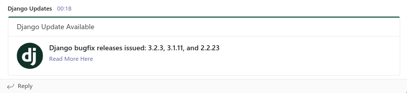

<h1 align="center" id="heading">Django Update Checker</h1>
<p align="center">
<a href="https://www.gnu.org/licenses/gpl-3.0" alt="License: GPLv3"></a>

</p>

This is a small script for checking any new updates/bugfixes/security fixes released in Django [News & Events](https://www.djangoproject.com/weblog/) and sending corresponding notifications in MS teams configured channel, without any deployments or server hosting, we are using [Scheduled events](https://docs.github.com/en/actions/learn-github-actions/events-that-trigger-workflows#scheduled-events) in Github actions for this. this is similar to cron jobs in UNIX systems

##### Screenshot

[](team_screenshot.png)

##### How to use

- Fork this repo
- Go to the actions page and enable actions on the forked repo (it will be disabled by default in the forked repo)
- Get an incoming Teams webhook URL. for reference, please check [Teams Incoming Webhook URL ](https://docs.microsoft.com/en-us/microsoftteams/platform/webhooks-and-connectors/how-to/add-incoming-webhook)
- Add webhook URL as `MS_TEAMS_WEBHOOK_URI` in your cloned repos Settings --> Secrets. for reference, please check [GitHub Secrets ](https://docs.github.com/en/actions/security-guides/encrypted-secrets#creating-encrypted-secrets-for-a-repository)
- If more types of titles want to be parsed, add them as words in `WORDS_TO_TRACK_IN_TITLE` in your cloned repos Settings --> Secrets. for reference, please check [GitHub Secrets ](https://docs.github.com/en/actions/security-guides/encrypted-secrets#creating-encrypted-secrets-for-a-repository)
  - Default keywords tracking is `["releases", "released", "release", "bugfix"]`
  - eg if add `--words = survey` resulting tracking list will be `["releases", "released", "release", "bugfix", "survey"]`
- If no extra keywords are to be tracked, add `WORDS_TO_TRACK_IN_TITLE` in the secrets with an empty string

##### Run Locally

Clone the project

```bash
  git clone git@github.com:prinzpiuz/django_update_checker.git
```

Install dependencies

```bash
  pip install -r requirements.txt
```

Start the server

```bash
  python checker.py --url <teams webhook url> --words security
```
